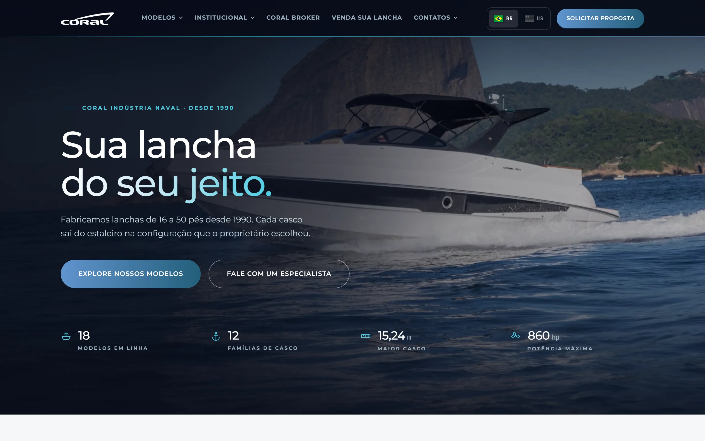
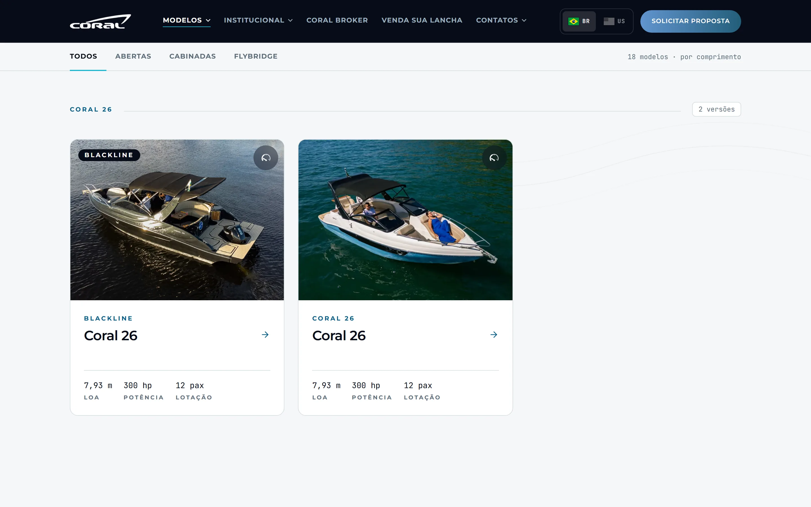
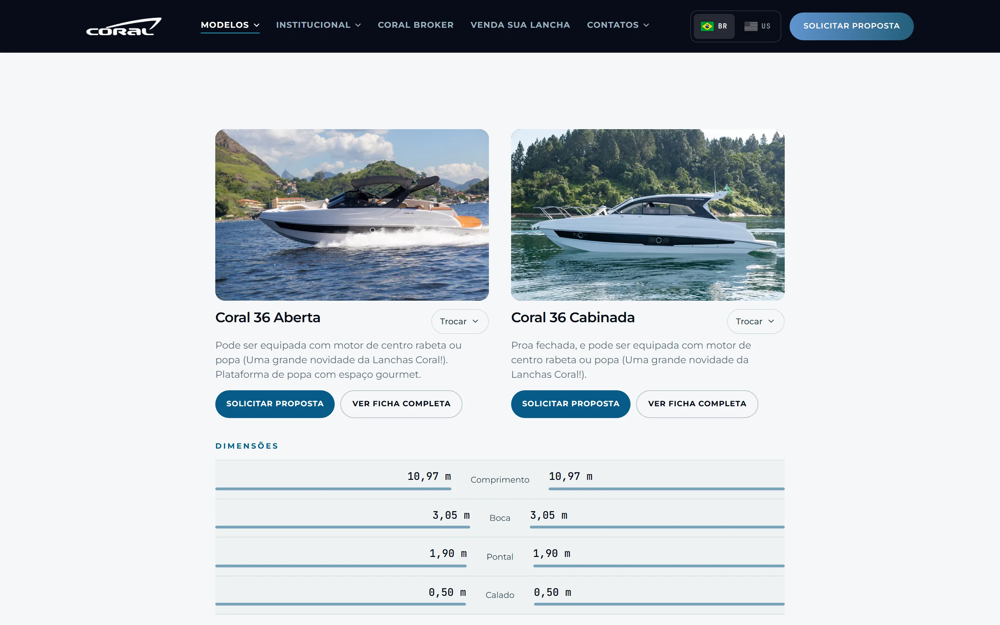
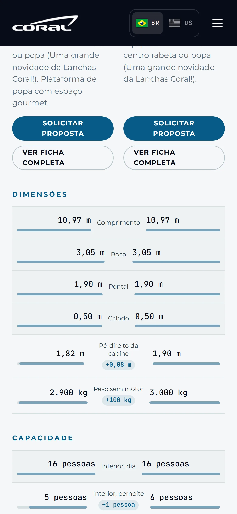

<div align="center">


**Institutional website and dashboard for a Brazilian boatyard.** A catalog of
18 models, a side-by-side comparison tool, pre-owned listings and a dashboard
where the client edits everything alone, without touching code.

[](LICENSE.md)
[](https://nextjs.org)
[](#quality)
[](#quality)

**[See it live](https://coral.nerdresolve.com)**



</div>

---

## Contents

- [What it is](#what-it-is)
- [Up in 5 minutes](#up-in-5-minutes)
- [Comparison tool](#comparison-tool)
- [The dashboard](#the-dashboard)
- [Architecture](#architecture)
- [Performance](#performance)
- [Quality](#quality)
- [Security](#security)
- [Command reference](#command-reference)
- [License](#license)

---

## What it is

**Lanchas Coral** has been building 16 to 50 foot boats since 1990, in Duque
de Caxias. The previous site was WordPress: every model sheet had its spec
sheet (*memorial descritivo*) pasted in by hand, and changing a phone number
meant opening seven pages.

This is the replacement. The real content, **18 models, 14 pre-owned boats,
836 photos and 365 equipment items**, was migrated into a database, and the
client now edits all of it through a dashboard. Changing a contact point is
one field now, and it changes on every page at once.

It is in production at **[coral.nerdresolve.com](https://coral.nerdresolve.com)**.



---

## Up in 5 minutes

Requires **Node 22+** and **Docker**.

```bash
git clone https://github.com/nerdresolve/coral.git
cd coral
cp .env.example .env      # and set POSTGRES_PASSWORD
docker compose -f infra/docker-compose.yml up -d --build
```

The site comes up on `http://localhost:3000` and the database on
`127.0.0.1:5433`.

To develop with hot reload:

```bash
cd apps/frontend
npm install
npx prisma migrate deploy
npm run dev
```

> **The content does not ship with it.** The photos, the PDF spec sheets and
> the copy belong to Coral and are not in the repository. Starting from
> scratch you get the structure working against an empty database. Create a
> model through the dashboard to see the full flow.

---

## Comparison tool

Two versions of the same hull differ in five rows out of eighteen. Finding out
which ones meant opening two tabs and flipping between them.



The speedometer icon on each card opens the list of the other boats. Picking
one opens the comparison **on top of the page**, without navigating away. From
there you can swap either side, browse other photos and request a quote, all
without closing it.

The **label sits in the middle**, between the two values. In a two-column grid
with the label on top, on a wide monitor the numbers ended up more than a
thousand pixels apart and the eye lost the association, which is exactly what
the comparison is there to provide.

The bars give you the reading before the number: "7.93" and "8.83" look alike
as text, but are visibly different as lengths. **There is no winner color**:
between two boats, bigger is not better. Someone shopping for a small marina
wants the smaller one.

Each pair has its own address (`/comparar?a=…&b=…`), so a comparison can be
bookmarked or sent to whoever is deciding alongside you.

---

## The dashboard

Ten screens under `/admin`, behind a session. The client creates and edits
models and pre-owned listings, reorders the gallery, writes the SEO for each
page, maintains the contact points and sends out spec sheets by email.

Three decisions that shaped the rest:

**Contact info in one place.** Phone and email were repeated in the footer, on
contact pages and in forms. They now live in a table, and changing one contact
point updates every occurrence serving that purpose.

**Sending a spec sheet is manual, by click.** Automatic delivery would send
the PDF to anyone who filled the form, competitors included. The dashboard
lists the requests and the operator decides one by one. There is a guard
against duplicate sends: the reservation happens in the database, inside the
transaction, so two fast clicks do not become two emails.

**Deleting requires typing the name.** A model carries dozens of photos and
equipment items, and one wrong click would wipe all of it.

---

## Architecture

```
apps/frontend/          Next.js 16 (App Router) + React 19
  src/app/(pt)/         Portuguese routes
  src/app/(en)/         English routes, with their own root layout
  src/app/(pt)/admin/   dashboard, behind a session
  src/components/       44 components
  src/lib/              pure logic: comparison, validation, email, crypto
  prisma/               16 tables, 8 migrations
  test/                 181 unit tests (Vitest)
  audit/                12 end-to-end suites (Playwright)
infra/                  Docker Compose, backup, Drive videos
docs/                   screenshots and brand identity
```

**Two languages, two root layouts.** `(pt)` and `(en)` are separate route
groups, each with its own `<html lang>`. It is not a switcher swapping
strings: they are independent trees, and Google indexes both.

**Postgres with a driver adapter.** Prisma 7 with `PrismaPg`, direct
connection. Concurrent writes to the gallery use `pg_advisory_xact_lock`.
Three fast saves once duplicated 57 photos into 114 before that lock existed.

**Tailwind v4 with tokens.** Colors, spacing and animation curves are CSS
variables in `@theme`, with no magic values scattered across components.

---

## Performance

Each model's hero can carry a **background video**, and it was the hardest
test of the architecture. The hero is the element Lighthouse measures as LCP,
and a heavy video there destroys the score.

The fix was for the video to **never be the LCP**. The photo loads with
`priority` and paints first. The video has `preload="none"`, only starts being
fetched after the page's `load`, and fades in once it has a frame to show.
Measured: **100 on performance with the video active, LCP of 0.6s**, against
0.7s on the same page without video.

The video is also **not downloaded** for anyone who asked for
`prefers-reduced-motion`, is on data saver, or is on a 2G network. A looping
background video causes real vestibular discomfort, and a few megabytes of
decoration do not justify themselves on a limited connection.

| Metric (desktop) | Result |
|---|---|
| Accessibility | **100** across all 17 pages |
| Best practices | **100** across all 17 pages |
| SEO | **100** across all 17 pages |
| Performance | 88 to 100, depending on the photo host's latency |

> The photos are still served by the old WordPress
> (`lanchascoral.com.br`), which responds in 0.28s in isolation and **3.74s
> under concurrency**. That is where all the performance variation comes from,
> since isolated measurements give 96 to 100. Hosting the images alongside the
> site fixes it, and that is the next step.

---

## Quality



**181 unit tests** (Vitest, about 2s) cover what is pure logic: the comparison
rules, the field validators, the encryption of the secrets, the email
assembly, the JSON-LD escaping and the backup retention.

**249 end-to-end cases** (Playwright, against the real site) cover what only
shows up in the browser:

| Suite | What it checks |
|---|---|
| `_teste-criacao` | creating a model and a listing from scratch, every field |
| `_teste-persistencia` | what was saved stays saved after a reload |
| `_teste-exclusao` | confirmation by typed name, and that cancel does not delete |
| `_teste-painel` | gallery, contacts, spec sheet and delivery |
| `_teste-email-config` | SMTP, denied domains, password not coming back to the HTML |
| `_pentest` | XSS, injection, IDOR, data leaks |
| `_pentest3` | double-click, request bursts, fields with no cap |
| `_teste-comparador` | 79 cases: flow, positioning and alignment |
| `_varredura` | 20 routes at 3 phone widths |

The sweep measures overflow, horizontal scrolling, touch targets under 44px
and clipped text at 390, 360 and 320px. It is what caught the 36px social
icons and the home buttons coming out clipped on an iPhone SE.

---

## Security

The dashboard holds SMTP credentials and the data of whoever requested a spec
sheet, so it got its own treatment:

- **Passwords with bcrypt** and a decoy hash when the user does not exist. The
  response time is the same, so valid emails cannot be discovered by timing.
- **Secrets with AES-256-GCM**, key kept outside the database. The SMTP
  password never comes back to the HTML once saved.
- **Serialized writes** via advisory lock, against races.
- **Size caps** calibrated against the real content, not guessed at.
- **Blockable domains** on delivery, so a spec sheet does not reach a
  competitor.

A real vulnerability was found and fixed along the way. The JSON-LD escaping
used `.replace(/</g, '<')`, which in JavaScript **is** the `<` character, that
is, a no-op. An automated pentest proved an injected script would execute. The
fix (`'\\u003c'`) was validated by reintroducing the defect: 7 of 10 tests
failed, as they should have.

---

## Command reference

| Command | What it does |
|---|---|
| `npm run dev` | development server |
| `npm run build` | production build |
| `npm test` | 181 unit tests |
| `npm run verificar` | typecheck, lint and unit tests |
| `npm run test:e2e` | the full battery of 249 cases against the site |
| `node audit/lh.mjs <url>` | Lighthouse across every page |
| `node audit/_varredura.mjs` | phone layout, 20 routes at 3 widths |
| `node infra/backup.mjs` | database copy, with verification |
| `node infra/backup.mjs --listar` | existing copies |
| `node infra/videos-do-drive.mjs` | pulls and compresses videos from Drive |

---

## License

**© 2026 NerdResolve. All rights reserved.**

Public repository for technical evaluation and portfolio demonstration. The
code may be read, studied and quoted with attribution, but no license to use,
copy or redistribute is granted. Details in **[LICENSE.md](LICENSE.md)**.

The visual identity, the photographs of the boats, the spec sheets and the
institutional copy belong to Lanchas Coral.

---

<div align="center">

Built by **[NerdResolve](https://github.com/nerdresolve)**

**[contact@nerdresolve.com](mailto:contact@nerdresolve.com)**

</div>
